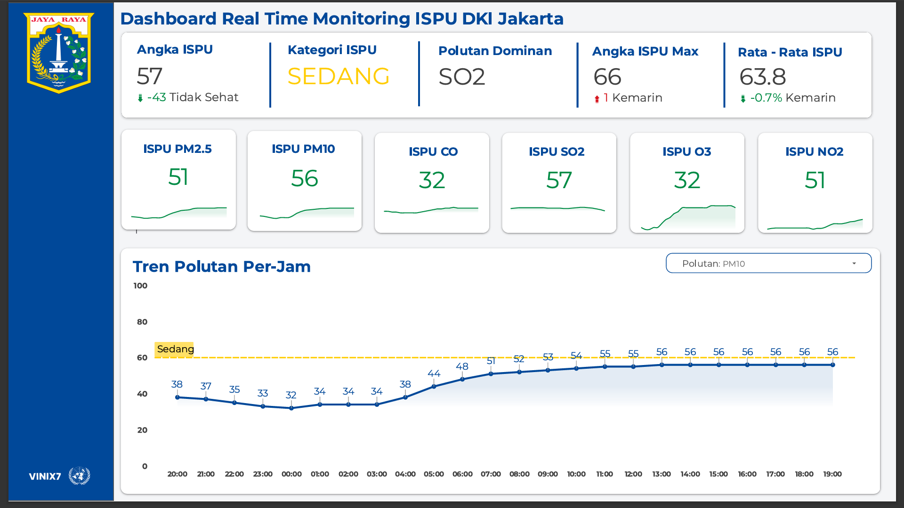
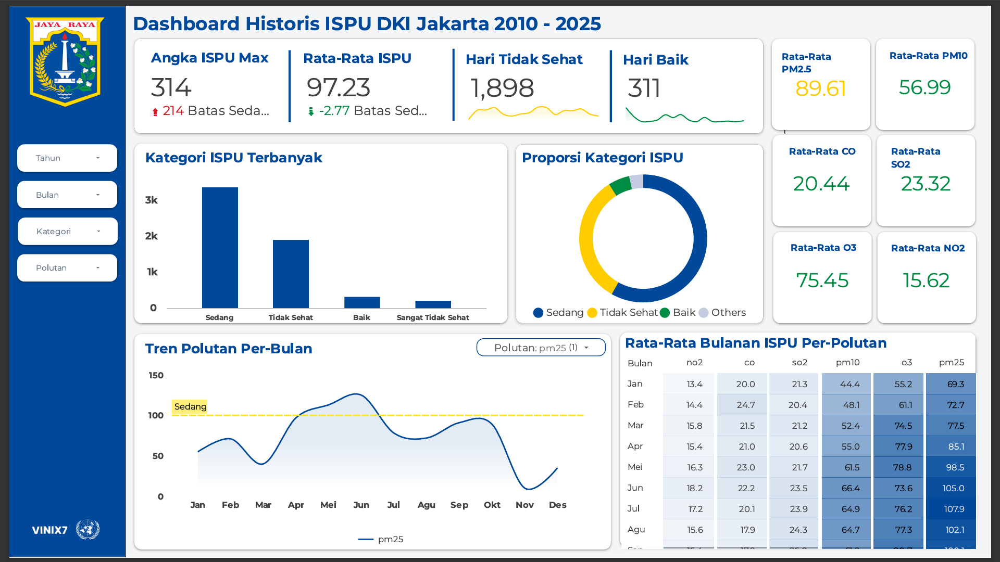

# 🌫️ Jakarta Air Quality (ISPU) Monitoring System

## 📖 Overview
Proyek ini adalah sistem pemantauan kualitas udara (ISPU) *end-to-end* untuk wilayah DKI Jakarta. Dashboard ini menggabungkan **analisis historis** jangka panjang dengan **data real-time** yang diambil langsung dari API Kementerian Lingkungan Hidup dan Kehutanan (KLHK).

Tujuannya adalah memberikan wawasan visual mengenai tren polusi udara, pola musiman, dan parameter polutan kritis (seperti PM2.5 dan CO) yang berdampak pada kesehatan warga Jakarta.

🔗 **[Lihat Live Dashboard di Sini](https://lookerstudio.google.com/reporting/8b1d71f0-766b-4338-9da3-ea14931d29f0)**

---

## 🚀 Key Features
* **Real-Time Monitoring:** Terhubung dengan API `ispu.kemenlh.go.id` untuk menampilkan kondisi udara terkini dari stasiun aktif.
* **Dynamic Pollutant Analysis:** Memungkinkan user mengganti parameter grafik (PM10 vs SO2 vs CO) dalam satu *chart* menggunakan data *Long Format*.
* **Automated Data Pipeline:** Menggunakan Google Apps Script untuk pengambilan data otomatis (ETL) setiap jam.
* **Health Categorization:** Visualisasi otomatis status kesehatan (Baik s/d Berbahaya) dengan *Conditional Formatting*.

---

## 🛠️ Architecture & Tech Stack

Proyek ini dibangun dengan alur kerja sebagai berikut:

1.  **Data Ingestion (Automation):**
    * **Tool:** Google Apps Script (JavaScript).
    * **Source:** API KLHK Public.
    * **Logic:** Script berjalan otomatis setiap jam (*Time-driven trigger*) untuk mengambil data JSON terbaru dan menyimpannya ke database.
    * **Code:** [`etl/ispu_ingestion.gs`](etl/ispu_ingestion.gs)

2.  **Data Transformation (Python):**
    * **Tool:** Python (Pandas) di Google Colab.
    * **Process:** Membersihkan data historis dan melakukan *unpivoting* (Wide to Long) untuk kebutuhan visualisasi tren.

3.  **Visualization:**
    * **Tool:** Google Looker Studio.
    * **Features:** Custom Calculated Fields, Blended Data, & Dynamic Filtering.

---

## 📂 Data Architecture

Dashboard ini menggunakan dua jenis struktur data untuk mengoptimalkan performa visualisasi:

### 1. `ISPU & ISPU_Long` (Transformed)
Data historis yang telah diubah menjadi format panjang (*unpivoted*).
* **Kegunaan:** Memungkinkan *Dropdown Filter* untuk memilih jenis polutan dalam Time Series Chart.
* **Struktur:** `Date` | `Polutan_Type` | `Value`

### 2. `ISPU_JAKARTA_HISTORIS & ISPU_JAKARTA_HISTORIS` (Aggregated)
Data lebar (*wide format*) yang mencakup nilai live/terbaru.
* **Kegunaan:** Menampilkan Scorecard, Gauge Chart, dan status "Dominant Pollutant" saat ini.
* **Struktur:** `Date` | `PM10` | `PM2.5` | `SO2` ...

---

## 📚 Documentation
Dokumentasi teknis lengkap tersedia di folder `docs/`:

* **[Data Dictionary](docs/data_dictionary.md)**: Penjelasan detail mengenai variabel polutan dan metadata.
* **[Calculated Fields](docs/calculated_fields.md)**: Logika di balik rumus kustom Looker Studio (seperti `MonthNum`, `Polutan_Value`, dll).

---

## 📊 Sample Insights
Berdasarkan analisis data historis:
1.  **Dominant Pollutant:** PM2.5 adalah polutan yang paling sering mencapai status "Tidak Sehat", terutama pada musim kemarau.
2.  **Hourly Trend:** Konsentrasi CO (Karbon Monoksida) memuncak pada pukul 07:00 - 09:00 dan 17:00 - 19:00, berkorelasi kuat dengan jam sibuk lalu lintas Jakarta.

---

## 📷 Gallery

| Live | Analytics |
| :---: | :---: |
|  |  |

---

## 👤 Author
**Imtiyaz Shaffal Afif**
* Data Enthusiast | Python, SQL, & Visualization
* [LinkedIn](linkedin.com/in/imtiyazsa)

---
*Credits: Data source by Kementerian Lingkungan Hidup dan Kehutanan (KLHK) Indonesia.*
